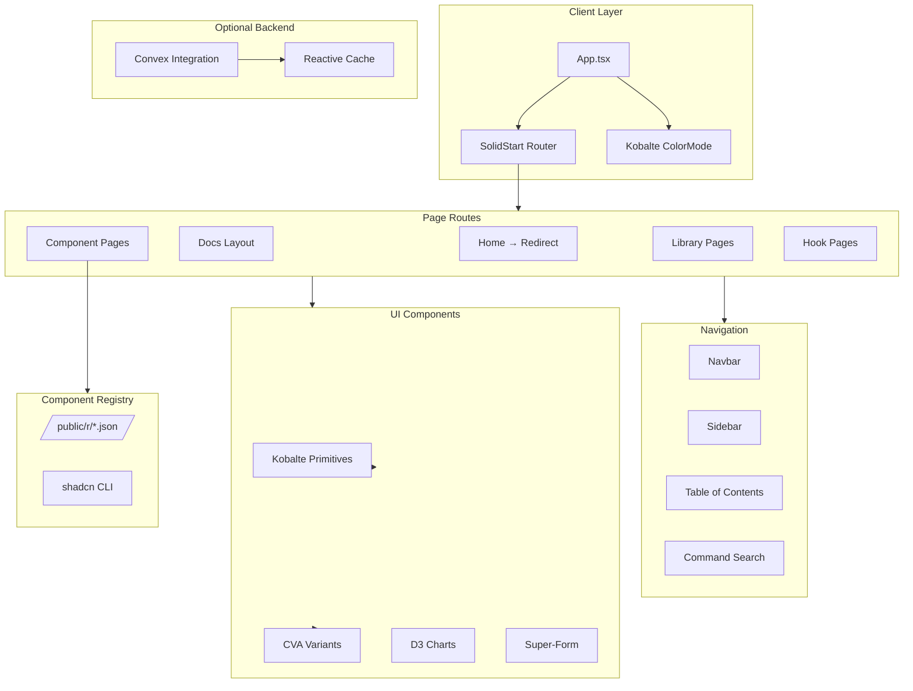
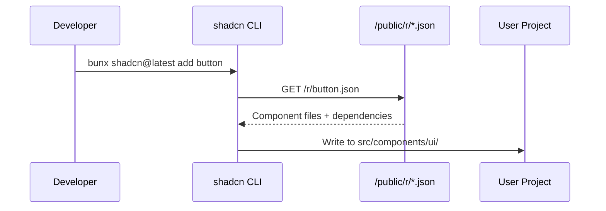
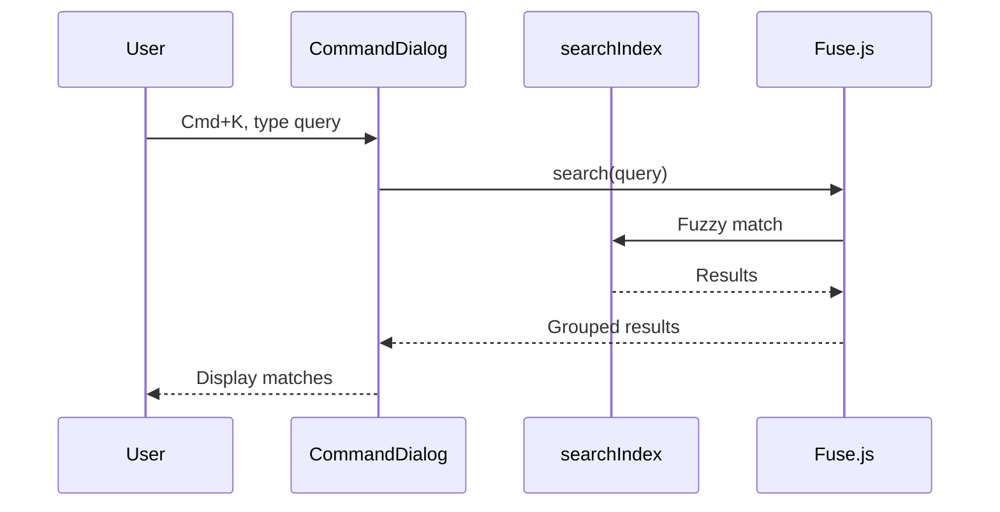
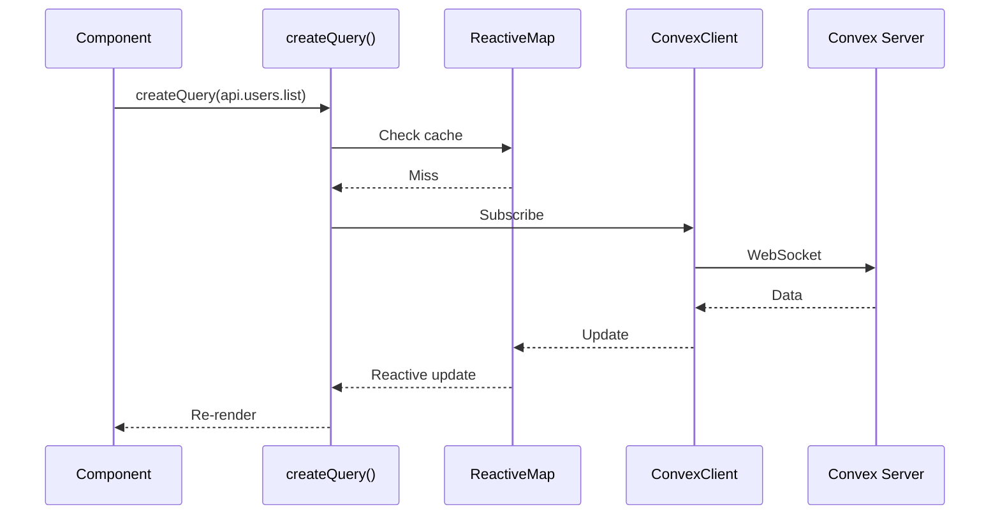

# Codebase Map

> Auto-generated by Cartographer. Last mapped: 2026-01-14

## System Overview

This is a **SolidJS component registry website** (similar to shadcn/ui but for SolidJS). It serves as a distribution platform for reusable SolidJS components, featuring UI components, form blocks, utility libraries, and custom hooks that developers can install via CLI commands.



## Directory Structure

```
rockitfuel-registry/
├── src/
│   ├── app.tsx                 # App root with theme/routing
│   ├── entry-client.tsx        # Client hydration entry
│   ├── entry-server.tsx        # SSR entry point
│   ├── hooks/                  # Custom SolidJS hooks
│   │   ├── use-bind-signal.ts    # Two-way data binding
│   │   ├── use-loading.ts        # Debounced loading state
│   │   ├── use-scrollspy.ts      # TOC heading detection
│   │   └── use-validated-search-params.ts  # URL param validation
│   ├── config/
│   │   └── docs.ts             # Navigation & sidebar config
│   ├── lib/
│   │   ├── utils.ts            # cn() class merger
│   │   ├── gatehouse.ts        # Authorization library
│   │   ├── date-utils.ts       # Date conversion utilities
│   │   ├── search-index.ts     # Fuse.js search index
│   │   ├── charts/             # D3 chart utilities
│   │   └── solid-convex/       # Convex integration
│   ├── types/
│   │   └── route.ts            # Route type definitions
│   ├── components/
│   │   ├── ui/                 # 50+ UI components
│   │   ├── charts/             # D3 chart components
│   │   ├── app-sidebar/        # Collapsible sidebar system
│   │   ├── helpers/            # Action buttons, empty states
│   │   ├── super-form/         # Modular-forms integration
│   │   └── [standalone].tsx    # Navbar, Footer, CodeBlock, etc.
│   ├── routes/
│   │   ├── (app).tsx           # App layout wrapper
│   │   └── (app)/docs/         # Documentation pages
│   └── registry/
│       └── new-york/           # Installable component variants
├── public/
│   └── r/                      # Registry JSON files
├── docs/                       # Documentation (this file)
├── app.config.ts               # SolidStart config (SSR disabled)
└── package.json                # Dependencies & scripts
```

## Module Guide

### Hooks (`src/hooks/`)

**Purpose**: Custom SolidJS hooks for reactive state management

| File | Purpose | Key Export |
|------|---------|------------|
| `use-bind-signal.ts` | Two-way data binding for controlled components | `useBindSignal<T>()` |
| `use-loading.ts` | Debounced loading state (300ms default) | `useLoading()` |
| `use-scrollspy.ts` | IntersectionObserver-based heading detection | `useScrollspy()` |
| `use-validated-search-params.ts` | Zod-validated URL search params | `useValidatedSearchParams()` |

**Patterns**: SolidJS reactivity with `createSignal`, `createEffect`, `createMemo`

---

### Configuration (`src/config/`)

**Purpose**: Site-wide configuration and navigation structure

| File | Purpose | Key Export |
|------|---------|------------|
| `docs.ts` | Navigation structure, registry URL | `docsConfig`, `REGISTRY_URL` |

**Data Structure**:
```typescript
{
  mainNav: NavElement[],
  sidebarNav: NavCategory[] // { title, items[] }
}
```

---

### Libraries (`src/lib/`)

**Purpose**: Shared utilities and integrations

| File/Dir | Purpose | Tokens |
|----------|---------|--------|
| `utils.ts` | `cn()` - Tailwind class merging | ~100 |
| `gatehouse.ts` | Zero-dep authorization (RBAC/ABAC/ReBAC) | ~8000 |
| `date-utils.ts` | Date conversion, Dutch format support | ~2000 |
| `search-index.ts` | Fuse.js fuzzy search index | ~500 |
| `charts/` | D3 chart utilities (scales, axes, tooltips) | ~10000 |
| `solid-convex/` | Convex reactive queries/mutations | ~3000 |

#### Gatehouse Authorization Library

Zero-dependency TypeScript authorization supporting:
- **RBAC**: Role-Based Access Control
- **ABAC**: Attribute-Based Access Control
- **ReBAC**: Relationship-Based Access Control
- Policy composition (AND, OR, NOT)
- Full evaluation trace for debugging

#### Chart Library (`src/lib/charts/`)

D3-based charting with SolidJS reactivity:
- `scales.ts` - Linear, time, band, point scales
- `axis.ts` - Axis generation and styling
- `tooltip.ts` - Interactive tooltip management
- `theme.ts` - CSS variable integration, color palettes
- `resize.ts` - ResizeObserver hooks
- `format.ts` - Number/date formatters

#### Solid-Convex Integration (`src/lib/solid-convex/`)

Reactive Convex database integration:
- `createQuery()` - Real-time subscriptions with caching
- `createMutation()` - Optimistic updates with rollback
- `prefetchConvex()` - SSR prefetching support

---

### UI Components (`src/components/ui/`)

**Purpose**: 50+ accessible UI components wrapping Kobalte primitives

**Key Components**:

| Component | Purpose | Variants |
|-----------|---------|----------|
| `button.tsx` | Button with loading state | default, destructive, outline, secondary, ghost, link |
| `dialog.tsx` | Modal dialog with portal | - |
| `select.tsx` | Dropdown select | - |
| `tabs.tsx` | Tabbed interface | - |
| `card.tsx` | Container with sections | - |
| `toast.tsx` | Notification system | default, destructive, success, warning, error |
| `command.tsx` | Command palette (cmdk) | - |
| `dropdown-menu.tsx` | Contextual menu | - |

**Common Patterns**:
1. **Kobalte Primitives**: ARIA-compliant accessibility
2. **CVA Variants**: `cva()` for variant-based styling
3. **splitProps**: Extract local props before spreading
4. **cn() Utility**: Tailwind class merging
5. **Polymorphic**: Support `as` prop for element type

---

### Charts (`src/components/charts/`)

**Purpose**: D3-based interactive chart components

| Component | Purpose |
|-----------|---------|
| `line-chart.tsx` | Multi-series line chart with tooltips |
| `scatter-chart.tsx` | Scatter plot with variable point sizes |

**Patterns**: ResizeObserver for responsiveness, reactive D3 scales

---

### App Sidebar (`src/components/app-sidebar/`)

**Purpose**: Collapsible sidebar with persistent state

| Component | Purpose |
|-----------|---------|
| `sidebar-provider.tsx` | Context + localStorage persistence |
| `sidebar-container.tsx` | Layout container with mobile support |
| `sidebar-button.tsx` | Navigation buttons |
| `sidebar-trigger.tsx` | Toggle button |

**Features**:
- Keyboard shortcut: Cmd/Ctrl + B
- Mobile responsive (< 767px)
- Section expansion persistence

---

### Super-Form (`src/components/super-form/`)

**Purpose**: Form components integrated with `@modular-forms/solid`

| Component | Purpose |
|-----------|---------|
| `modular-input.tsx` | Input with label, error, clear button |
| `modular-select.tsx` | Select with async options support |
| `modular-combobox.tsx` | Searchable select |
| `modular-checkbox.tsx` | Checkbox with label |
| `modular-date-picker.tsx` | Date picker integration |
| `modular-label.tsx` | Label with required indicator |
| `modular-error.tsx` | Animated error message |

**Pattern**: Manual `dispatchEvent("input")` for modular-forms compatibility

---

### Standalone Components

| Component | Purpose |
|-----------|---------|
| `navbar.tsx` | Top navigation with search, theme toggle |
| `sidebar.tsx` | Docs sidebar (different from app-sidebar) |
| `mobile-nav.tsx` | Mobile navigation drawer |
| `search.tsx` | Command palette (Cmd+K) |
| `code-block.tsx` | Shiki syntax highlighting |
| `install-command.tsx` | Multi-package-manager install tabs |
| `block-viewer.tsx` | Preview/code viewer with file tree |
| `component-page.tsx` | Standard component docs layout |
| `table-of-contents.tsx` | On-page navigation |
| `docs-pager.tsx` | Prev/next page navigation |
| `copy-button.tsx` | Clipboard with feedback |
| `mode-toggle.tsx` | Light/dark/system switcher |

---

### Routes (`src/routes/`)

**Purpose**: File-based routing with SolidStart

| Route | Purpose |
|-------|---------|
| `(app).tsx` | App layout (Navbar + Footer + Toaster) |
| `(app)/index.tsx` | Homepage → redirects to docs |
| `(app)/docs.tsx` | Docs layout (Sidebar + TOC) |
| `(app)/docs/getting-started.tsx` | Getting started guide |
| `(app)/docs/components/*.tsx` | 29 component documentation pages |
| `(app)/docs/blocks/*.tsx` | Block documentation |
| `(app)/docs/libraries/*.tsx` | Library documentation |
| `(app)/docs/hooks/*.tsx` | Hook documentation |

---

### Registry (`src/registry/`)

**Purpose**: Installable component source files

Contains "new-york" style variants that get compiled to `/public/r/*.json` for CLI installation.

---

## Data Flow

### Component Installation Flow


### Search Flow


### Convex Data Flow


## Conventions

### Naming
- Components: PascalCase (`Button.tsx`)
- Hooks: camelCase with `use` prefix (`useLoading.ts`)
- Utilities: camelCase (`cn`, `formatDate`)
- Types: PascalCase (`NavElement`, `Policy`)

### Styling
- **Tailwind CSS** for all styling
- **CVA** for variant management
- **cn()** for class merging
- CSS variables for theming (via Kobalte)
- `data-[state]` attributes for animations

### Component Patterns
```tsx
// Standard component structure
export function MyComponent(props: MyComponentProps) {
  const [local, others] = splitProps(props, ["class", "variant"]);
  return (
    <div class={cn(variants({ variant: local.variant }), local.class)} {...others}>
      {props.children}
    </div>
  );
}
```

### Form Integration
```tsx
// Modular-forms pattern
const handleChange = (e: Event) => {
  // Manual dispatch for modular-forms
  e.target.dispatchEvent(new Event("input", { bubbles: true }));
};
```

## Gotchas

### 1. SSR is Disabled
`app.config.ts` has `ssr: false`. All rendering is client-side.

### 2. Hydration-Safe Code
Client-only operations must use `onMount` or `isServer` checks:
```tsx
onMount(() => {
  // Client-only code (event listeners, DOM manipulation)
});
```

### 3. Validated Search Params
Invalid values are silently rejected (logged to console only). Always provide defaults.

### 4. Convex Cache Keys
Format: `${functionName}|${JSON.stringify(args)}`. Argument order matters.

### 5. Date Utilities
Default timezone: `Europe/Amsterdam`. Dutch date formats prioritized.

### 6. Modular-Forms Integration
Requires manual event dispatching - Kobalte components don't trigger native events.

### 7. Chart Refs
Must initialize as `undefined` (not `null`) due to SolidJS ref semantics.

### 8. Sidebar State
All sections default to collapsed. State persisted in localStorage.

## Navigation Guide

### To add a new UI component:
1. Create `src/components/ui/[name].tsx`
2. Add registry entry in `src/registry/new-york/ui/[name].tsx`
3. Run `bun run build:registry` to generate JSON
4. Add documentation page at `src/routes/(app)/docs/components/[name].tsx`
5. Update `src/config/docs.ts` to add to sidebar

### To add a new library:
1. Create `src/lib/[name].ts`
2. Add documentation at `src/routes/(app)/docs/libraries/[name].tsx`
3. Update `src/config/docs.ts`

### To add a new hook:
1. Create `src/hooks/use-[name].ts`
2. Add documentation at `src/routes/(app)/docs/hooks/use-[name].tsx`
3. Update `src/config/docs.ts`

### To modify the sidebar:
1. Edit `src/config/docs.ts` → `sidebarNav` array
2. Add status badges with `badge: "new"` or `badge: "updated"`

### To add a chart type:
1. Create component in `src/components/charts/[type]-chart.tsx`
2. Use utilities from `src/lib/charts/`
3. Follow patterns from `line-chart.tsx`

## Tech Stack

| Category | Technology |
|----------|------------|
| Framework | SolidJS + SolidStart |
| Routing | @solidjs/router (file-based) |
| Styling | Tailwind CSS + CVA |
| UI Primitives | @kobalte/core |
| Forms | @modular-forms/solid |
| Charts | D3.js (v7) |
| Search | Fuse.js |
| Syntax Highlighting | Shiki |
| Icons | lucide-solid |
| Toasts | solid-sonner |
| Animations | solid-motionone |
| State Persistence | @solid-primitives/storage |
| Backend (optional) | Convex |
| Build | Vite + Vinxi |
| Linting | Biome (Ultracite preset) |
| Runtime | Bun |
